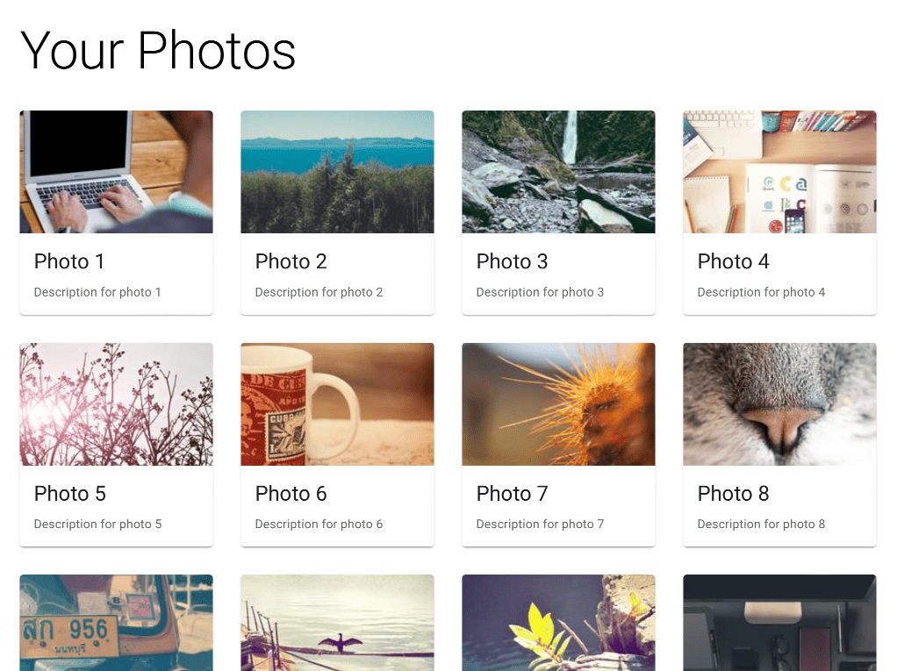

# Photo Gallery

This React application fetches photos from https://picsum.photos, and shows them in a grid with sample titles and
descriptions. Clicking on a photo will show that photo in a larger view, switching to full screen on smaller devices
to make use of limited screen real estate.

## Requirements

- Internet access is required to view photos, fetch the Roboto font used by Material UI, and install dependencies.
- Node.JS 16 and npm

## Running the Application

1. Clone this repository.
2. Run `npm install` in the root of the cloned directory.
3. Run `npm start`.

## Running Tests

Run `npm test` in the root of the cloned directory. This assumes that steps 1 and 2 above have been completed.

## External Libraries

- [axios](https://www.npmjs.com/package/axios) for issuing web requests.
- [eslint](https://www.npmjs.com/package/eslint) to ensure correctness of TypeScript source code (for development).
- [miragejs](https://www.npmjs.com/package/miragejs) to mock the image server in both development and testing.
- [prettier](https://www.npmjs.com/package/prettier) to ease code formatting and consistency (for development).
- [@mui/material](https://www.npmjs.com/package/@mui/material) for the UI framework.
